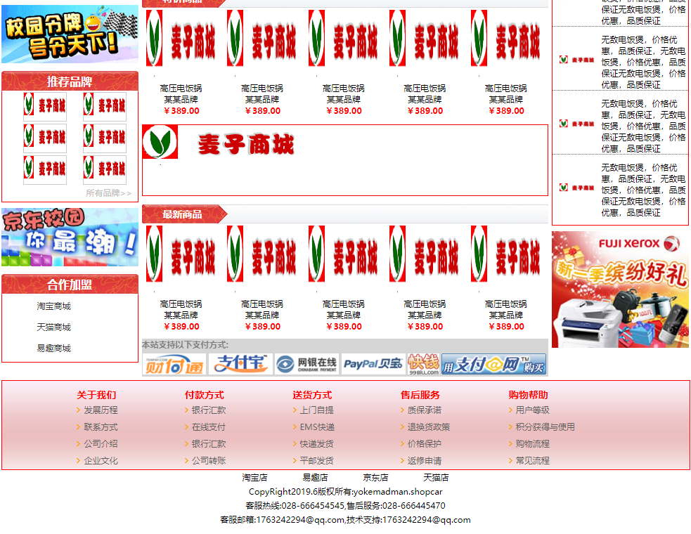
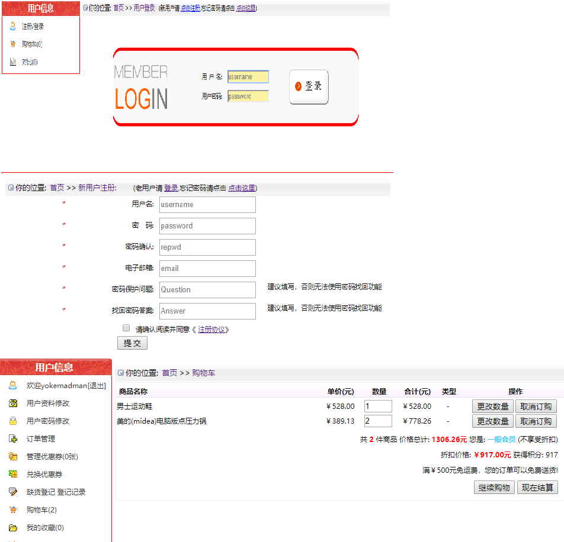
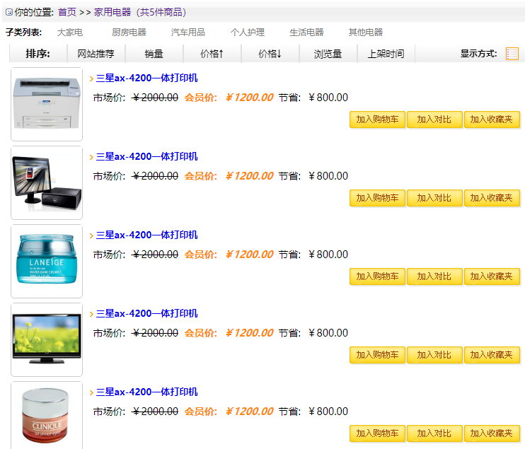
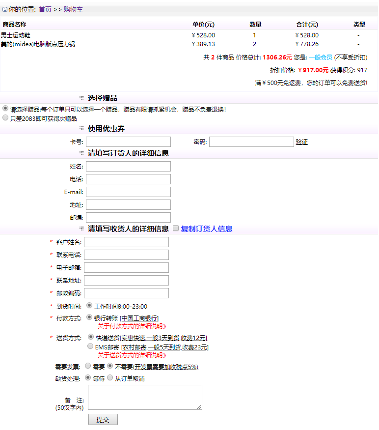

## yokemadman
**Git小白一个&emsp;[&ensp;[github博客](https://yokemadman.github.io/)&ensp;]&emsp;[&ensp;[博客园](https://www.cnblogs.com/Yokemadman/)&ensp;]**

 ### 电子商城
&emsp;本次项目是一个电子商城方面的项目，有少许的动态效果，并点击实现跳转，包包括登录、注册、商品列表、菜单等页面,
&emsp;对于项目图片的问题，没有去找更多的图片，只用一张图片代替，数据也没有去用数据库，只是一些静态的数据，见谅！！！

网站发布：

 

**[ 效果图预览 ]**
#### 主页

#### 登录、注册、购物车

#### 列表

#### 发货单

#### 商品详情

